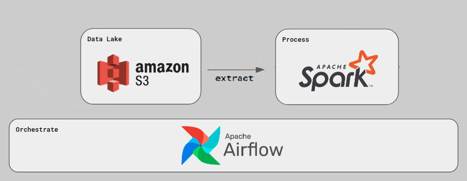

# ETL-spark-airflow-s3

This project is for educational purposes to learn the basics of Spark, Airflow, S3 technologies, and the ETL process in general. The goal is to connect all those technologies into a simple and functional project.

The architecture of the project is represented by the following:



Also, the repository consist of:
* Airflow DAG file that orchestrates the tasks
* S3 python file for accessing S3 data lake using credentials
* PySpark file used for data processing

## Set-up

#### Apache Airflow

First, install [Apache Airflow](https://airflow.apache.org/)

Start the scheduler:  ```airflow scheduler```

Start the web server: ```airflow webserver --port 8080```

Then enable and run specific tasks!

### Spark

First, install [Spark](https://spark.apache.org/docs/latest/index.html)

Start the Spark Master with: ```spark bin/start-master.sh```

Start the Spark Worker with: ```spark bin/start-worker.sh <MASTER_URL>```

### S3

Create an AWS account and connect the python script using Boto3 AWS Python Module (or Airflow hook system)

***Note***: This project is based on the idea of [renatootescu](https://github.com/renatootescu) and his [ETL repository](https://github.com/renatootescu/ETL-pipeline)


